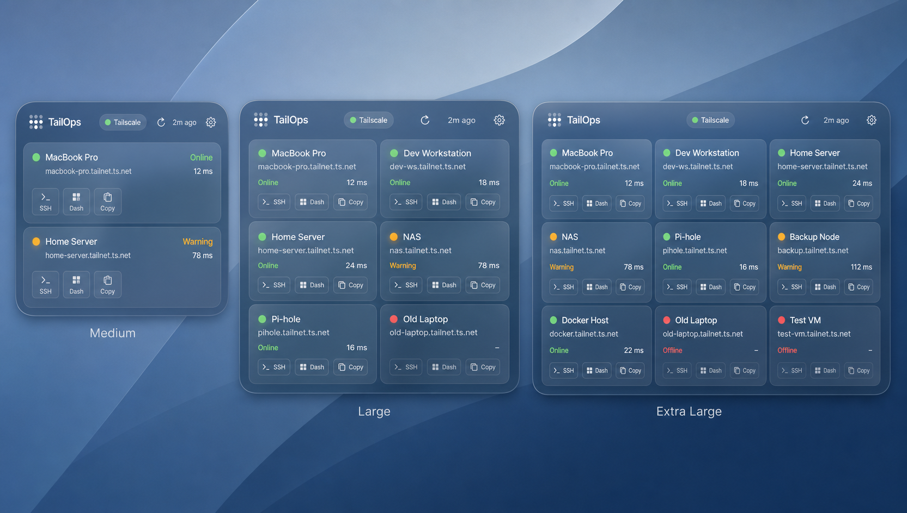
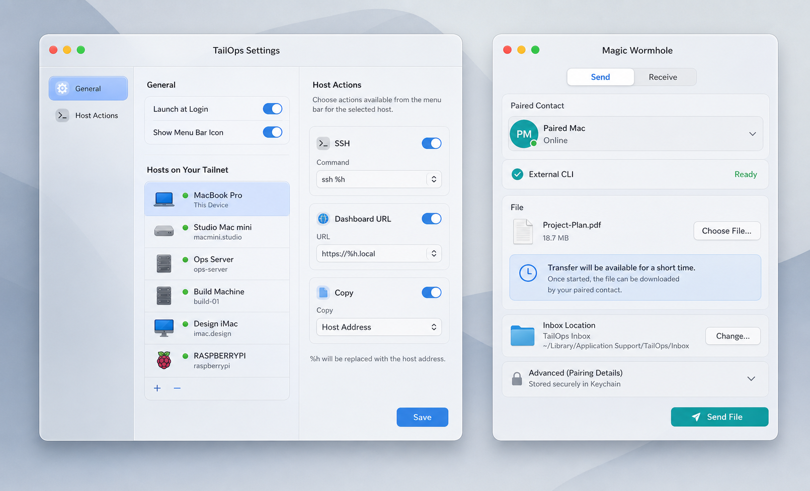

# TailOps glass refresh

Status: implemented on `codex/tailops-liquid-glass-refresh`

## Goal

Make the native widget, Settings window, and Wormhole window feel like one modern macOS product while preserving TailOps storage formats, App Group behavior, Keychain boundaries, refresh cadence, and transfer behavior.

## Direction

- Keep the native TailOps structure and use adaptive materials, restrained blue and teal tints, continuous rounded corners, subtle borders, and shallow depth.
- Keep status color semantic: green for online or ready, orange for warning, and red for offline. Do not wash entire cards in status color.
- Make host selection and action configuration easier to scan without changing the persisted action model.
- Give Wormhole a clear readiness, paired-contact, file-transfer, and advanced-pairing hierarchy. Pairing secrets remain in Keychain.
- Remain compatible with the project's macOS 14 deployment target. Do not require newer Liquid Glass APIs.

## Reference concepts

These are visual direction, not pixel specifications. The implemented UI must stay truthful to current TailOps behavior. In particular, Wormhole keeps both Send and Receive actions visible because transfer mode is driven by the originating widget intent, and the settings UI edits the existing per-host action model.

## Acceptance boundary

- Medium, large, and extra-large widgets preserve all current intents and show readable host/action hierarchy.
- Large widgets use a two-column host grid; extra-large widgets use three columns.
- Settings preserves launch-at-login behavior and uses a host-focused action editor. The dormant menu-bar preference is not exposed as if it controlled a current menu-bar surface.
- Wormhole preserves CLI detection, contact selection, pairing, Keychain secret storage, file drop, send, receive, and status behavior.
- A focused Swift package build passes.
- Installed proof records the exact Xcode build product, executable hashes, running process path, and the single registered widget extension path.

## Non-goals

- No persistence migration, filename change, App Group change, or Keychain schema change.
- No transfer protocol or refresh-cadence change.
- No QR pairing or transfer cancellation implementation.
- No browser dashboard redesign.
- No macOS 26-only material API.
